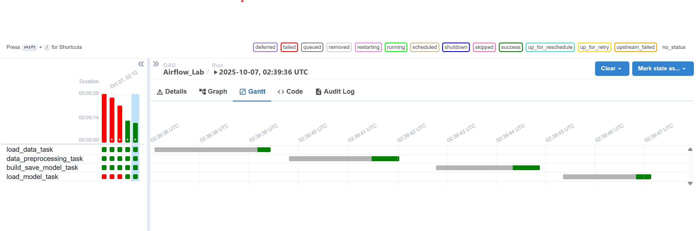
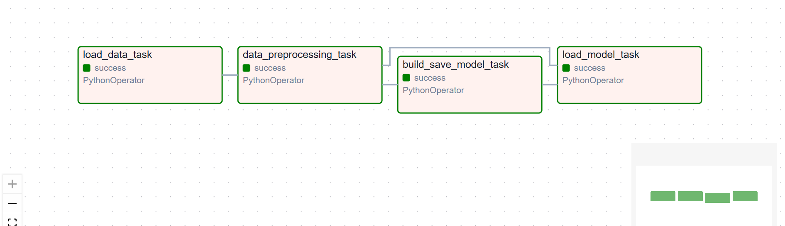

# Airflow Lab 2

This assignment demonstrates the use of Apache Airflow for orchestrating machine learning workflows. Airflow Lab 1 has been performed and the pipeline implements K-means clustering on the Wine Dataset. 

## Project Structure

- `docker-compose.yaml`: Docker Compose file to set up Airflow and its dependencies.
- `config/`: Configuration files for Airflow.
- `dags/`: Contains DAG definitions and related code.
  - `airflow.py`: Main DAG file orchestrating the workflow.
  - `model/`: Stores the trained model (`model.sav`).
  - `src/`: Source code for data processing and model training (`lab.py`).
- `logs/`: Airflow logs for DAG runs and tasks.
- `plugins/`: Custom Airflow plugins (if any).
- `working_data/`: Directory for intermediate or working data.


## Main Components

- **DAG (`airflow.py`)**: Defines the workflow for data loading, preprocessing, model training, saving, and loading.
- **Model (`model.sav`)**: Serialized machine learning model.
- **Source Code (`src/lab.py`)**: Contains functions for data loading, processing and model operations.

## Getting Started

1. **Clone the repository**
    ```bash
    git clone https://github.com/NikhilAPrakash/mlops_labs.git
    cd airflow_lab2
    ```
2. **Start Airflow using Docker Compose:**
   ```sh
   docker compose up
   ```
3. **Access the Airflow UI:**
   - Open your browser and go to `http://localhost:8080`
   - Credentials: `airflow2` / `airflow2`
4. **Trigger the DAG** from the Airflow UI to run the workflow.

## Requirements

- Docker & Docker Compose
- Apache Airflow (managed via Docker)

## Notes

- All logs are stored in the `logs/` directory.
- Update the DAG or source code as needed for your specific ML workflow.


## Results




## References
- [Apache Airflow Documentation](https://airflow.apache.org/docs/)
