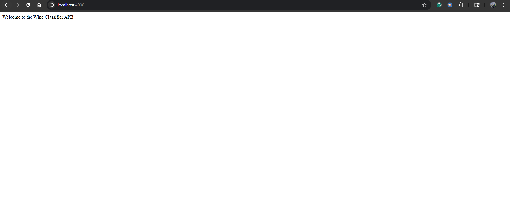
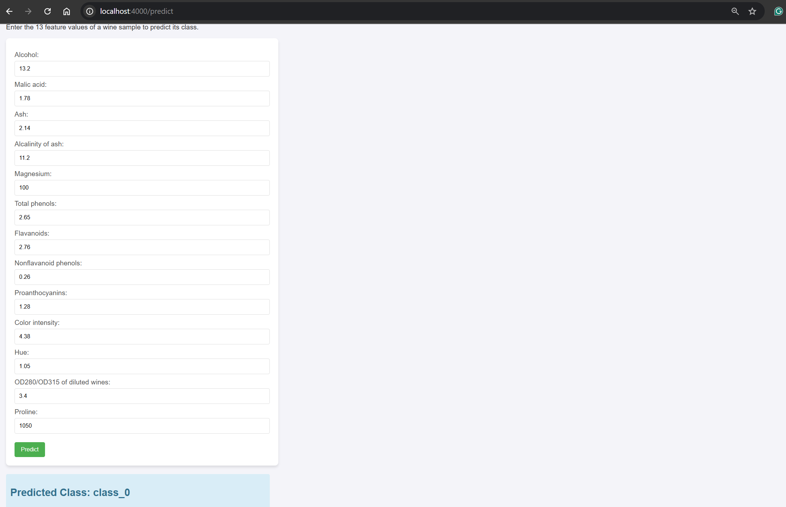

# Docker Lab 6 — Wine Classifier (Training + Serving)

This lab demonstrates a minimal MLOps workflow packaged with multi-stage Docker builds:

- The model_training stage trains a small TensorFlow model on the Wine dataset and writes a saved model (`my_model.keras`) to the `model_output/` folder.
- The serving stage starts a small Flask app that loads `my_model.keras` and exposes a POST `/predict` endpoint and a small HTML form at GET `/predict`.

This project is designed to show a simple, reproducible containerized pipeline where training and serving are in the same repository and built in separate Docker stages.

---

## Repository layout (docker_lab6)

- `docker-compose.yml` — runs two services: `model_training` (build & train) and `serving` (load saved model and run Flask server).
- `dockerfile` — multi-stage Dockerfile with two targets: `model_training` and `serving`.
- `src/` — application source:
	- `model_training.py` — trains a TensorFlow model on the scikit-learn Wine dataset and saves `my_model.keras`.
	- `main.py` — Flask app that loads `my_model.keras` and exposes prediction endpoints.
	- `templates/predict.html` — a small web form for manual testing.
- `model_output/` — contains output artifacts (e.g. `my_model.keras`).
- `requirements.txt` — Python dependencies used by both build stages.

---

## Requirements

- Docker (Desktop or Engine) and the Docker CLI
- docker compose or docker-compose available on your PATH

Note: Training uses TensorFlow which may require memory/CPU resources — training inside the container is intended for demonstration only.

## Quick start — Build & run (all-in-one)

This Docker Compose setup will run the model_training stage first (it trains and saves the model to `model_output/`) and then start the serving Flask app which serves predictions on port 4000.

From the `docker_lab6` folder run (Windows / modern Docker):

```cmd
docker compose up --build
```

Or (older Docker Compose CLI):

```cmd
docker-compose up --build
```

After the compose command finishes building and training, the API will be reachable at:

- http://localhost:4000/     — simple welcome message
- http://localhost:4000/predict — GET shows the HTML form, POST expects form fields `feature1` through `feature13` and returns JSON `{ "predicted_class": "class_x" }`.

To stop containers:

```cmd
docker compose down
```

## Running only the serving step (with a pre-saved model)

If `model_output/my_model.keras` already exists (either because training finished or you copied the file), you can start only the serving service which will load that model and run the API:

```cmd
docker compose up --build serving
```

Or run the serving target directly by building the `serving` image:

```cmd
docker build -f dockerfile --target serving -t docker_lab6_serving .
docker run -p 4000:4000 -v %CD%\model_output:/app -e NAME=World docker_lab6_serving
```

## Example Predict usage (cURL)

Example curl using form-encoded fields (13 numeric features in the Wine dataset):

```sh
curl -X POST http://localhost:4000/predict \
	-d "feature1=13.2" -d "feature2=1.78" -d "feature3=2.14" -d "feature4=11.2" \
	-d "feature5=100" -d "feature6=2.65" -d "feature7=2.76" -d "feature8=0.26" \
	-d "feature9=1.28" -d "feature10=4.38" -d "feature11=1.05" -d "feature12=3.4" \
	-d "feature13=1050"

# Response example:
#{ "predicted_class": "class_1" }
```

Or open `http://localhost:4000/predict` in a browser and use the form to submit the same data.

## Results





## Files of interest

- `src/model_training.py` — key place to change model, dataset, or training parameters
- `src/main.py` — prediction-serving logic; change ports or API behavior here
- `dockerfile` — contains the two targets that form the multi-stage build used by `docker-compose.yml`.

## Troubleshooting / Notes

- If the container logs show training taking long, the training step runs 50 epochs — reduce `epochs` in `model_training.py` for faster iteration.
- If Flask fails to start because port 4000 is in use, stop the conflicting service or change the port mapping in `docker-compose.yml`.
- The trained model file is saved as `my_model.keras` under `model_output/` so the serving stage has stable input to load.

---

