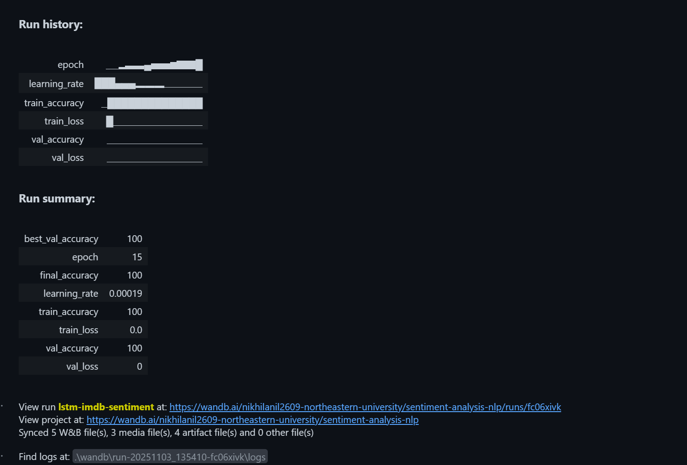
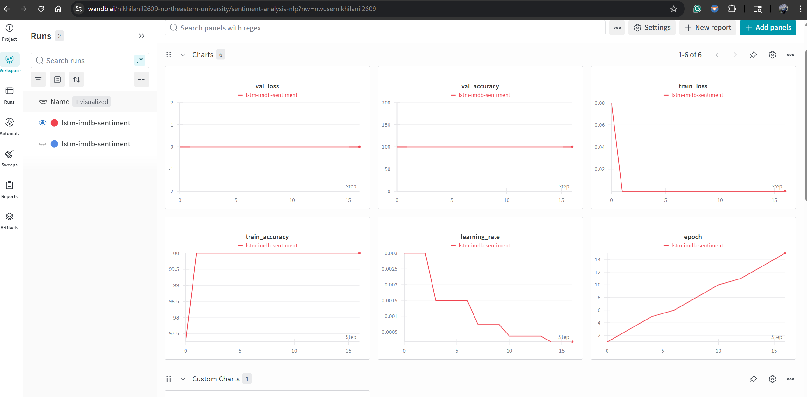
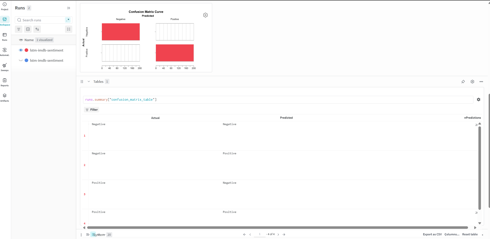

# Experiment Tracking — Sentiment Analysis (lab4)

This notebook (experiment_tracking_lab4.ipynb) demonstrates training and tracking a simple LSTM-based sentiment classifier. It uses a small synthetic dataset of positive/negative reviews, trains an LSTM model, logs metrics and artifacts to Weights & Biases (wandb), and saves the best PyTorch model to `best_sentiment_model.pth`.

## What the notebook does

- Loads/constructs a toy sentiment dataset (positive and negative example sentences).
- Defines a PyTorch LSTM model (`SentimentLSTM`) and a `SentimentDataset` for batching.
- Trains the model and logs training/validation loss & accuracy to Weights & Biases.
- Logs a confusion matrix to wandb every 5 epochs.
- Saves the best validation model to `best_sentiment_model.pth` and uploads it as a wandb Artifact.

## Primary implementation details

- The model and training loop are implemented using PyTorch (torch).
- The notebook also contains commented installation lines for TensorFlow/Keras — these are not used for the LSTM training in the visible cells, but the notebook includes the following pinned dependency lines (see cells in the notebook):

  - `tensorflow==2.15.1`
  - `keras==2.15.0`

  These appear in a commented pip-install cell in the notebook. The active training code uses PyTorch.

## Libraries / Dependencies (used or installed in notebook)

- Python (being used here): 3.9.13 (to be compatible with the tensorflow and keras libraries being used here)
- TensorFlow: 2.15.1 (noted in the notebook install cell)
- Keras: 2.15.0 (noted alongside TensorFlow)
- PyTorch (torch) — used for the LSTM model (version not pinned in the notebook; use a recent stable release compatible with your CUDA/Python)
- scikit-learn — used for train_test_split (noted installed in a notebook cell)
- wandb — for experiment tracking and artifact logging
- xgboost — installed in a notebook cell 
- numpy

Note: Only TensorFlow/Keras versions are explicitly referenced in the notebook comments. Other packages (torch, scikit-learn, wandb, xgboost, numpy) are installed/used without pinned versions. 

## Where outputs go

- The best model is saved locally as `best_sentiment_model.pth`.
- The run logs, metrics, and a model artifact are uploaded to your Weights & Biases project (the notebook calls `wandb.init()` and `run.log_artifact()`).

## Activate the included .venv (Windows) (Since this is being run on a virtual environment)

Command Prompt (cmd.exe):

```cmd
cd \path\to\experiment_tracking_lab4
\.venv\Scripts\activate.bat
```

Git Bash / MSYS (POSIX-style shell on Windows):

```bash
source .venv/Scripts/activate
```

## How to run the notebook

1. Activate the project's virtual environment (see above).
2. Open `experiment_tracking_lab4.ipynb` in the browser and run cells (or run the cells sequentially in VS Code interactive mode).


Important: The notebook calls `wandb.login()` — before running, authenticate either by running `wandb login` and pasting your API key, or by setting the `WANDB_API_KEY` environment variable.


## Results

The results obtained are displayed as follows



