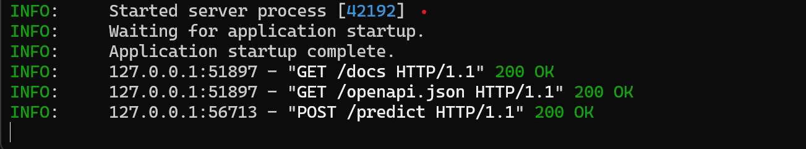

# FastAPI Lab 1

This project demonstrates a simple MLOps workflow using FastAPI for serving a machine learning model to classify wine data. The repository includes code for data loading, model training, prediction, and serving predictions via a REST API.

## Folder Structure

```
fastapi_lab1/
├── Readme.md                # Project documentation
├── requirements.txt         # Python dependencies
├── model/
│   ├── iris_model.pkl       # (Unused) Example model file
│   └── wine_model.pkl       # Trained wine classifier model
├── src/
│   ├── __init__.py
│   ├── data.py              # Data loading and splitting
│   ├── main.py              # FastAPI app (API endpoints)
│   ├── predict.py           # Model loading and prediction
│   └── train.py             # Model training script
```

## Features

- **Model Training**: Uses scikit-learn to train a logistic regression model on the wine dataset.
- **API Serving**: FastAPI app exposes endpoints for health check and wine prediction.
- **Prediction**: Loads the trained model and predicts wine class from input features.

## How to Use

### 1. Install Requirements
```bash
pip install -r requirements.txt
```

### 2. Train the Model
Run the training script to generate `model/wine_model.pkl`:
```bash
cd src
python train.py
```

### 3. Start the FastAPI Server
```bash
cd src
uvicorn main:app --reload
```
The API will be available at `http://127.0.0.1:8000/`.

### 4. API Endpoints
- `GET /` — Health check endpoint. Returns `{ "status": "healthy" }`.
- `POST /predict` — Predict wine class. Expects a JSON body with wine features:

```json
{
	"alcohol": 13.2,
	"malic_acid": 1.78,
	"ash": 2.14,
	"alcalinity_of_ash": 11.2,
	"magnesium": 100.0,
	"total_phenols": 2.65,
	"flavanoids": 2.76,
	"nonflavanoid_phenols": 0.26,
	"proanthocyanins": 1.28,
	"color_intensity": 4.38,
	"hue": 1.05,
	"od280_od315_of_diluted_wines": 3.4,
	"proline": 1050.0
}
```
Returns:
```json
{
	"response": 1
}
```

### 5. Results


## Notes
- The `iris_model.pkl` is present but not used in this lab.
- All code is in the `src/` directory.
- The model is retrained each time you run `train.py`.

---
**Author:** NikhilAPrakash
