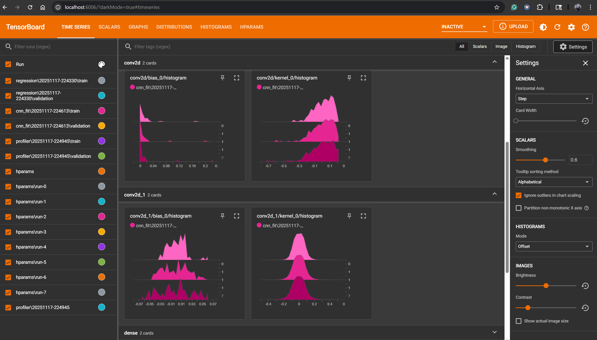
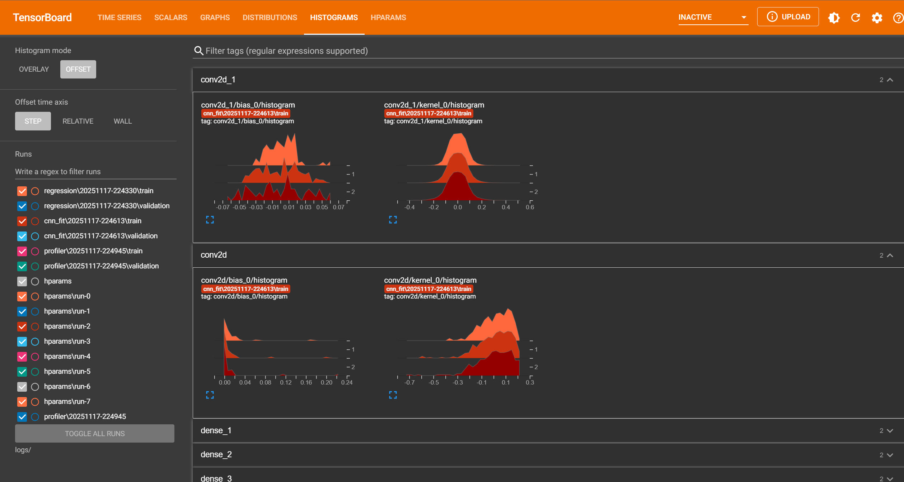
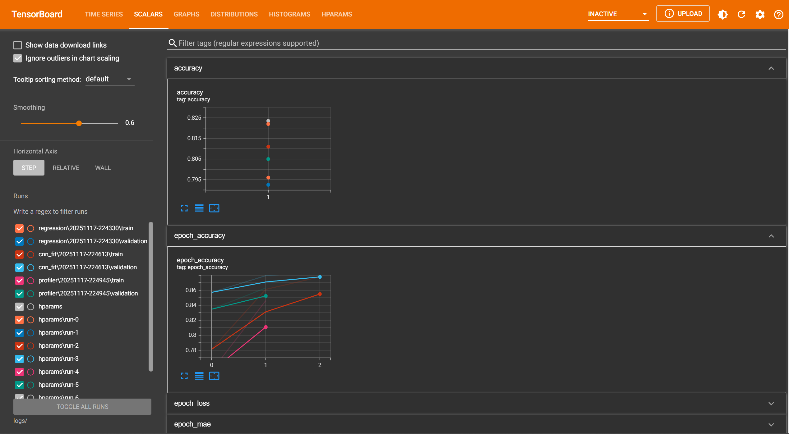

# TensorBoard Lab
This lab merges all major TensorBoard concepts from Labs 1–4 into a single unified workflow.
It includes:
- Scalars, Graphs, and Debugger (Regression model)
- CNN Classification with TensorBoard (Graphs + Histograms)
- Profiler Integration (Performance analysis)
- Hyperparameter Tuning (HParams dashboard)

## Setup

This lab uses:
- TensorFlow 2.x
- Keras
- TensorBoard
- HParams plugin
- Fashion-MNIST dataset
- Synthetic regression dataset

Before running the lab:
```bash 
pip install tensorflow tensorboard
```

Start the notebook with:
```bash
%load_ext tensorboard
!rm -rf ./logs/
```

Tensorboard logs will be saved to:
```
logs/
 ├── regression/
 ├── cnn_fit/
 ├── profiler/
 └── hparams/

```

## 1. **Regression Model**  
   - Scalars (loss, MAE)  
   - Histograms  
   - Graph visualization  
   - TensorFlow Debugger integration  

## 2. **CNN Classifier (Fashion-MNIST)**  
   - Model architecture graph  
   - Training curves  
   - Activation/weight histograms  

## 3. **Performance Profiling**  
   - TensorBoard Profiler (batch-level profiling)  
   - Device and kernel insights  

## 4. **Hyperparameter Tuning (HParams Dashboard)**  
   - Parallel coordinates visualization  
   - Trial summaries  
   - Grid-based search over units, dropout, optimizer  


## Features

- Fully structured TensorBoard logging
- HParams dashboard for tuning experiments
- Profiler integration for performance analysis
- CNN and regression model visualizations
- Clean modular code suitable for reuse in MLOps pipelines


## Results

Some snapshots of the tensorboard UI



